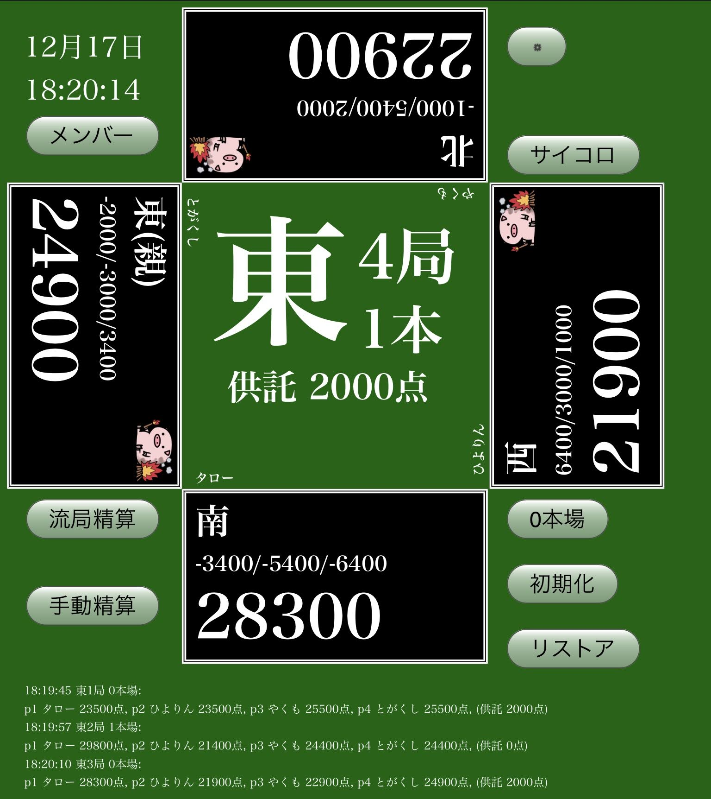

# mja : 手動麻雀点数表示ボード MahJongg Assistant board

点数表示のない麻雀卓でプレイするときに点棒のやりとりをせずに遊ぶために作った、ニッチなプログラムです。
スマホやタブレットのブラウザで表示して使うため、固定サイズ/幅のシンプルなレイアウトをしています。

## 使い方

HTML/CSSとJavaScript (jQuery) しか使ってません。サーバかローカルの適当な場所に置いて、Webブラウザでhtdocs/index.htmlを読み込めば動作します。

### 主な想定ルール

- アリアリのリーチ麻雀用です
- 30符4翻は7700, 11600 (満貫切り上げなし)にしてあります
- 親は聴牌連荘です
- ダブロン、トリロン時の供託は上家どり、本場は全員につきます(操作方法は後述)

### 主な操作

- メンバー設定ボタン
    - p1〜p4に、起家から順番にプレイヤー名を入力しておくと見やすいです
- サイコロボタン
    - サイコロを2個振ります
- 自風、焼き鳥(焼き豚)、点差表示
    - タップするとリーチできます
    - 焼き鳥(焼き豚)表示はおまけ機能なので、マニュアル操作できません
        - 真剣に使う日がきたら、操作できるようにします
- 各家の点数表示
    - タップすると、タップした人のあがりとして精算ダイアログが開きます
- 点数精算ダイアログ
    - 翻数と符を入力、あがったプレイヤー、放銃したプレイヤーを指定します
    - ツモあがりの場合は他3人を指定します
    - 供託、本場が自動計算され、親以外があがった場合は次の局に進みます
    - ダブロン、トリロン時の操作は後述します
- 流局精算ダイアログ
    - テンパイしていたプレイヤーを指定します
    - 親がノーテンの時は局が進みます

### マニュアル操作用

だいたいの場合は上の操作手順でいけますが、イレギュラー対応は手動でする必要があります。

- 0本場ボタン
    - 本場をクリアしたいときに押します
- 手動精算ボタン
    - 点数をプレイヤーと供託間でやりとりします
- 場風表示
    - タップすると東-南-西-北の順で表示されます
- 局表示
    - タップすると1局〜4局の順で表示されます
- リストアボタン
    - 場の状況を以前の局終了時に戻したいときに使います

### イレギュラー対応について

割り切って機能を絞り、点数表示に徹しているので、ある程度のイレギュラー対応が必要です。

- ダブロン、トリロン時の操作方法
    - 放銃者から見て上家の点数を精算(供託が含まれます)
        - 点数計算ダイアログで「連続精算」チェックボックスをチェックします(局が進みません)
    - 他家の点数を精算
        - 親があがり者に含まれている場合、全員の精算で「連続精算」チェックボックスをチェックします
            - 全員終わったら、「本場」をクリックして1本積みます
        - 親があがり者に含まれていない場合、最後の精算では「連続精算」チェックを外します(局が進みます)
- チョンボ時の精算方法
    - 手動精算ボタンを使ってください
- 誤リーチ、誤ポン、誤チーなどの罰符対応
    - 手動精算ボタンを使って、供託に点数を移動してください

## スクリーンショット

## 使用したもの

- [jQuery](https://jquery.com)
- [jQueryUI](https://jqueryui.com)
- サイコロの画像と処理
    - [JavaScript：サイコロを振る](https://torisky.com/javascript%EF%BC%9A%E3%82%B5%E3%82%A4%E3%82%B3%E3%83%AD%E3%82%92%E6%8C%AF%E3%82%8B/)
- サイコロを振る音
    - [音人](https://on-jin.com/)
- リーチ音声
    - macOS の say コマンド
- 焼鳥(焼豚)イラスト
    - [イラストAC](https://www.ac-illust.com/)
